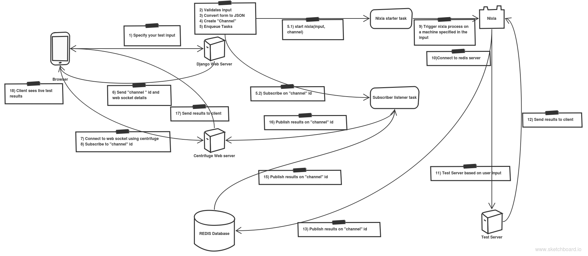

# nixia console

nixia console is a web console built with [Python 2.7][0] using the [Django Web Framework][1]. The purpose of this is to run [nixia](https://github.com/niks3089/nixia/) testing tool on any remote machines and be able to view the test results on your browser

This project has the following components:

* Redis server
* Centrifuge
* Webserver

## Design
Please download and view the image

### Installation

Install tcl
Install [redis] (http://redis.io/):

Set up virtual enviornment

    virtualenv -p /opt/rh/python27/root/usr/bin/python2.7 ~/ven_nixia_console

Install all dependencies:

    pip install -r requirements.txt

Apply migrations

    CONF_IP=127.0.0.1 python manage.py migrate

Run the server

    ./scripts/start_service.sh <server ip>
    
Stop the server

    ./scripts/stop_service.sh

### Detailed instructions

